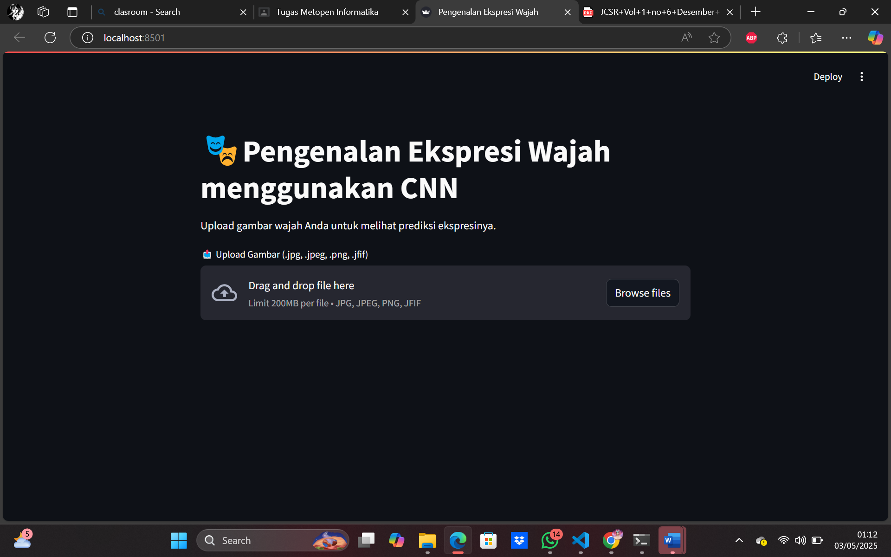

Demo ini di buat untuk memenuhi tugas metodologi penelitian informatika 

Pengenalan Ekspresi Wajah menggunakan Convolutional Neural Network (CNN)
Dataset yang di gunakan: 
FER-2013, tersedia dalam format CSV dari kompetisi Kaggle. Dataset ini telah dibagi menjadi:
1. Training: 28.709 gambar
2. Validation & Testing: 7.178 gambar

Arsitektur CNN yang di gunakan:
1. 4 layer konvolusi (Conv2D) dengan ReLU activation
2. MaxPooling
3.Dropout untuk regularisasi
4. Fully Connected (Dense) layer dengan Softmax output untuk 7 kelas ekspresi

